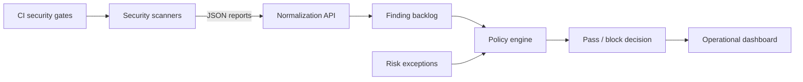

# Sentinel Flow

Sentinel Flow is a DevSecOps security orchestration platform built as an independent portfolio project. It centralizes pipeline runs, normalizes scanner findings, evaluates merge policies, tracks remediation SLAs and manages time-bound risk exceptions.

## Product capabilities

- Executive security overview with risk and delivery metrics
- Pipeline runs with SAST, SCA, secrets, container and DAST gates
- Finding backlog with severity, ownership, SLA and remediation state
- Policy engine for critical, high and exposed-secret thresholds
- Required-scanner coverage rules
- Risk exception request, approval, rejection and expiration
- Semgrep, Trivy and Gitleaks report normalization
- Demo RBAC for security engineer, developer and manager roles
- Audit trail for policy, finding, ingestion and exception changes

## Run locally

```bash
node src/server.js
```

Open `http://127.0.0.1:4000`.

With Docker:

```bash
docker compose up -d --build
```

## Tests

```bash
node --test
```

The suite covers policy decisions, active and expired exceptions, scanner coverage, API headers, run details, RBAC, triage, policy updates and scanner ingestion.

## Policy model

A run is blocked when any configured rule fails:

- Critical findings exceed the maximum
- High findings exceed the maximum
- Exposed secrets exceed the maximum
- A required scanner did not pass
- An approved exception expired

Resolved findings and active approved exceptions are removed from evaluation. Every remaining finding contributes to the run risk score.

## Scanner integrations

| Input | Normalized gate |
| --- | --- |
| Semgrep JSON | SAST |
| Trivy vulnerability JSON | SCA or container |
| Gitleaks JSON | Secrets |

The ingestion endpoint creates or updates a run, normalizes findings, assigns the project owner and immediately reevaluates policy.

## Demo roles

The role selector exists to demonstrate server-side authorization decisions without adding an identity provider to this portfolio app.

| Role | Capabilities |
| --- | --- |
| Security engineer | Ingest, change policies, triage and review exceptions |
| Developer | Triage findings and request exceptions |
| Engineering manager | Read-only visibility |

Production deployment would replace `X-Demo-Role` with claims from an OIDC identity provider.

## Architecture



## Delivery pipeline

- Node security and policy tests
- Semgrep OWASP SAST
- GitHub CodeQL
- Gitleaks secret scanning
- Trivy container scanning
- SPDX SBOM generation
- Docker smoke test

## Documentation

- [Architecture](docs/ARCHITECTURE.md)
- [API reference](docs/API.md)
- [Demo script](docs/DEMO_SCRIPT.md)
- [Portfolio case study](docs/PORTFOLIO_CASE_STUDY.md)

## Current scope

Data is intentionally stored in memory to keep the demo deterministic and dependency-free. The repository boundary is designed so a PostgreSQL adapter, OIDC provider and real GitHub/GitLab webhooks can be added without changing the policy engine.
