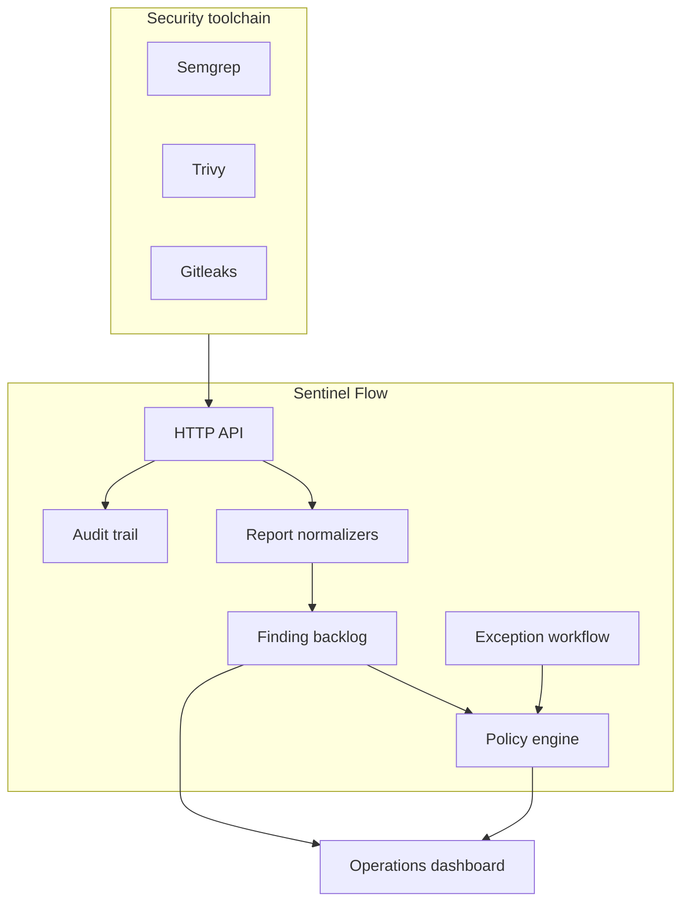

# Architecture

## Components

## Domain boundaries

- `normalizers.js`: translates scanner-specific JSON into one finding contract.
- `policy-engine.js`: pure, deterministic decision function with no HTTP or storage dependency.
- `server.js`: HTTP server composition and static/API dispatch.
- `api.js`: route handlers, workflow orchestration and audit events.
- `auth.js`: demo role extraction and server-side authorization checks.
- `http.js`: JSON parsing, static file serving and defensive headers.
- `data.js`: deterministic seed dataset for portfolio demonstrations.
- `public/`: operational frontend with no build step.

## Finding lifecycle

`open -> in_progress -> resolved`

Alternative terminal states are `accepted` and `false_positive`. Risk acceptance should normally use a formal exception so it remains time-bound and auditable.

## Exception lifecycle

`pending -> approved | rejected -> expired`

Expiration is evaluated dynamically by the policy engine. An expired approved exception no longer suppresses the finding and can independently block the run.

## Authorization

The API enforces three demo roles:

- `security`: full control
- `developer`: finding triage and exception requests
- `manager`: read only

The role header is explicitly a demo seam. A production design would validate OIDC tokens and map groups to permissions.

## Security characteristics

- Strict CSP without inline scripts
- Frame denial and MIME sniffing protection
- Two MiB request limit for scanner reports
- Output encoding for imported scanner content
- Allowlisted workflow states and roles
- Time-bound exception requirement
- Non-root, read-only container
